# Project - Analysis of FBI NICS Firearm Background Checks

### *WGU - Intro to Data Science*
### *Alexander J. Pfleging*

 

## Table of Contents
<ul>
<li><a href="#intro">Introduction</a></li>
<li><a href="#initial-review">Data Wrangling - Initial Review</a></li>
<li><a href="#cleaning">Data Wrangling - Cleaning</a></li>
<li><a href="#explore">Exploratory Data Analysis</a></li>
<li><a href="#conclusions">Conclusions</a></li>
</ul>

 

#

## Introduction

For this project, we will be exploring the relationships between metrics found in the FBI Firearm Dataset and various US Census metrics from the Gapminder suite. We'll also be utilizing a table that I put together to use as a reference for US States.

- [US States](https://github.com/AlexJPF/nics-firearm-project/blob/0b245bb460da1ce6b5716862e32d7eef86979c58/data/us-states.csv)
- [FBI NICS Firearm Data](https://github.com/AlexJPF/nics-firearm-project/blob/0b245bb460da1ce6b5716862e32d7eef86979c58/data/fbi-gun-data.csv) *[\[1\]][1]*
- [US Census Data](https://github.com/AlexJPF/nics-firearm-project/blob/0b245bb460da1ce6b5716862e32d7eef86979c58/data/us-census-data.csv) *[\[2\]][2]*

 

### First Things First
Before getting started, we need to import our packages, set a few options in pandas, and call a magic function to render plots directly in the notebook (instead of displaying a dump of the figure object).

~~~python
# import packages
import pandas as pd
import numpy as np
import seaborn as sns
import matplotlib.pyplot as plt
from scipy.stats import pearsonr

# set pandas options
pd.options.mode.chained_assignment = None
pd.set_option('display.max_rows', 1000)
pd.set_option('display.min_rows', 100)
pd.set_option('display.max_columns', 100)
pd.set_option('display.width', 1000)
pd.set_option("expand_frame_repr", True)

# magic function to render plot in notebook
%matplotlib inline
~~~

 

#

## Data Wrangling - Initial Review

In this section of the notebook, we will load our dataframes and check the existing data structure.

 

### US States Reference Table

~~~python
# load dataset into pandas dataframe
dfStates = pd.read_csv('data/us-states.csv')
~~~

~~~python
# check the df shape (1.1)
dfStates.shape

# check data types (1.2)
dfStates.dtypes

# preview df (1.3)
dfStates.head()
~~~

 *Figure 1.1*   
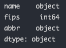 *Figure 1.2*   
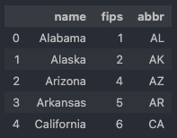 *Figure 1.3*   

The US States Reference Table dataset is already clean and ready to go.  
The only cleaning we'll do in the next section is to tidy up the column headers.

  

### FBI Firearm Data

~~~python
# load dataset into pandas dataframe
dfGunData = pd.read_csv('data/fbi-gun-data.csv')
~~~

~~~python
# check the df shape (2.1)
dfGunData.shape

# check data types (2.2)
dfGunData.dtypes

# preview df
dfGunData.head()
~~~

 *Figure 2.1*   
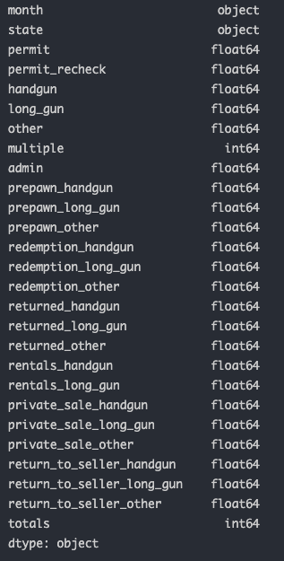 *Figure 2.2*   

There are only a few items that need to be cleaned in the next section with the FBI Firearm dataset:
- First, we need to create a year column based on the provided month column
- Next, for clarity, we should move that year column in the dataframe to be next to the existing month column

  

### US Census Data

~~~python
# load dataset into pandas dataframe
dfCensus = pd.read_csv('data/us-census-data.csv')
~~~

~~~python
# check the df shape (3.1)
dfCensus.shape

# check data types
dfCensus.dtypes

# preview df (3.2)
dfCensus.head()
~~~

 *Figure 3.1*   
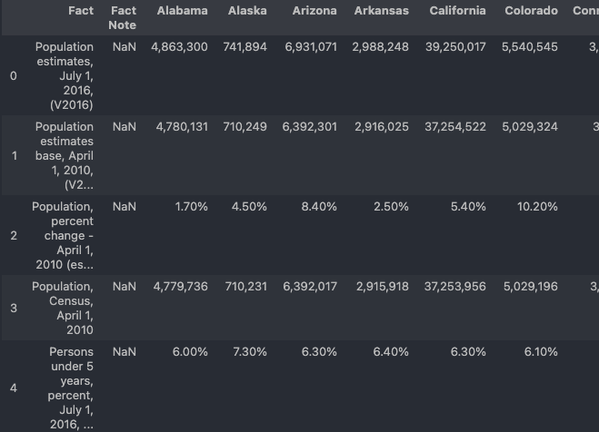 *Figure 3.2*   

There is a lot of cleaning to do in the next section with the US Census dataset:
- First we will remove the rows after the actual metrics since they contain notes and not data
- The data will be easier to work with if we convert it to long format so we need to melt the dataset
- After that, we should clean the column headers and fix any incorrect data types

 

#

## Data Wrangling - Cleaning

Now that we've reviewed the initial data structures it's time to start cleaning the data.  

We'll start by creating two functions:
- Function to clean the column headers, since that needs to be done to each dataframe.
- Function to perform quick group-by operations

~~~python
# function to clean column headers
def CLEAN_COLUMN_HEADERS(df):
    df.columns = df.columns.str.lower()  # change headers to lowercase
    df.columns = df.columns.str.strip()  # remove leading/trailing whitespace
    df.columns = df.columns.str.replace(' ', '_')  # replace spaces with underscores
    print(df.columns, '\n')

# function to perform quick group-by tallies
def TALLY(df, col, export=False):
    tally = df.groupby(col).size().sort_values(ascending=False).reset_index(name='count')

    if export:
        tally.to_csv('tally-output.csv', index=False)
    else:
        print(tally, '\n')
~~~

 

### US States Reference Table

~~~python
# clean column headers (4.1)
CLEAN_COLUMN_HEADERS(dfStates)
~~~

 *Figure 4.1*  

  

### FBI Firearm Data

~~~python
# clean column headers
CLEAN_COLUMN_HEADERS(dfGunData)

# create year column based on existing month column
dfGunData['year'] = dfGunData['month'].str[:4]

# create list of columns in df
colsGunData = dfGunData.columns.tolist()

# move year column in list order, then align df with column list
colsGunData = colsGunData[-1:] + colsGunData[:-1]
dfGunData = dfGunData[colsGunData]

# print columns in df (4.2)
dfGunData.columns
~~~

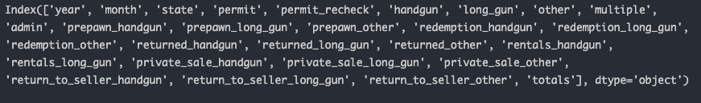 *Figure 4.2*  

  

### US Census Data

The other two dataframes were pretty clean to begin with, but the US Census data needs some more work. 

 

First we need to remove the records towards the bottom of the dataframe; these rows contain notes and not useful data.

~~~python
# remove the rows after the actual metrics
dfCensus = dfCensus.loc[:63]
~~~

 

Next we'll reshape the dataframe from a wide format to long format and clean the column headers.

~~~python
# rename fact column to 'metric'
dfCensus = dfCensus.rename(columns={'Fact': 'metric'})

# create metric_id
dfCensus.reset_index(level=0, inplace=True)
dfCensus['metric_id'] = dfCensus['index'] + 1
del dfCensus['index']

# create a list of states to use as id_vars when melting dfCensus
stateList = dfStates['name'].unique()

# reshape dataframe into long format (melt)
dfCensus = pd.melt(dfCensus,
                   id_vars=['metric_id', 'metric'],
                   value_vars=stateList,
                   var_name='state',
                   value_name='value')

# clean column headers (4.3)
CLEAN_COLUMN_HEADERS(dfCensus)
~~~

 *Figure 4.3*    

Now that the dataframe is in a workable format, we're going to apply a numpy vectorization method to efficiently create two new fields.

~~~python
# create list of value flags to remove before converting to numeric
valueFlags = 'D F FN NA S X Z'.split()

# create lists of conditions and results for vectorization method
conditions = [
    dfCensus['value'].str.endswith('%'),
    dfCensus['value'].str.startswith('$') & dfCensus['value'].str.contains(',', na=False),
    dfCensus['value'].str.startswith('$'),
    dfCensus['value'].str.contains(',', na=False),
    dfCensus['value'].isin(valueFlags)
]

resultsValueType = [
    'percent',
    'currency',
    'currency',
    'number',
    'value_flag'
]

resultsValue = [
    dfCensus.value.str[:-1].str.strip(),
    dfCensus.value.str[1:].str.replace(',', '').str.strip(),
    dfCensus.value.str[1:].str.strip(),
    dfCensus.value.str.replace(',', '').str.strip(),
    np.NaN
]

# create value_type using vectorization lists (5.1)
dfCensus['value_type'] = np.select(conditions, resultsValueType, default='number')
TALLY(dfCensus, 'value_type')

# create new_value using vectorization lists (5.2)
dfCensus['new_value'] = np.select(conditions, resultsValue, default=dfCensus.value)
TALLY(dfCensus, 'new_value')
~~~

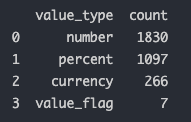 *Figure 5.1*    
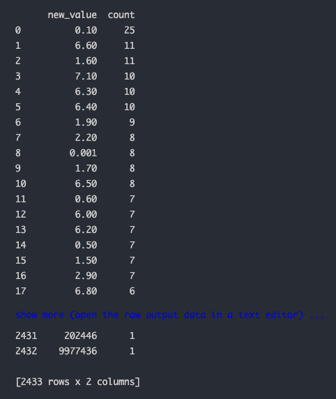 *Figure 5.2*    

Next we just need to clean up the new_value and replace the current value

~~~python
# convert new_value to numeric
dfCensus['new_value'] = pd.to_numeric(dfCensus['new_value'])
dfCensus.dtypes

# adjust percent values using vectorization
dfCensus['value_percent_fix'] = np.where(
    dfCensus.value_type == 'percent',  # parameter
    dfCensus.new_value / 100,  # true branch
    dfCensus.new_value)  # false branch

# assign cleaned value field to 'value' and drop extra fields
dfCensus['value'] = dfCensus.value_percent_fix
dfCensus = dfCensus.drop(columns=['new_value', 'value_percent_fix'])
~~~

  

## Create Focused Metric Table for Analysis

- There are a dozens of metrics in both the FBI Firearm dataset and the US Census dataset which can be overwhelming when analyzing and searching for patterns.
- Before we start any exploratory data analysis, we need to trim these datasets down and focus on a handful of interesting metrics.
- After selecting our metrics, we can combine them all into one table and start looking for patterns.

 

### Total Gun Registrations (2016)

We'll start by getting the total gun registrations by state for 2016 (the year for which we have Census data).

~~~python
# Total Gun Registrations (2016)

# filter fbi gun df to 2016
mask = (dfGunData['year'] == '2016') & (dfGunData['state'].isin(stateList))
dfGunTotals = dfGunData[mask]

# combine totals, grouping by state
dfGunTotals = dfGunTotals[['state', 'totals']]
dfGunTotals = dfGunTotals.groupby(['state'], as_index=False).sum()

# rename totals column
dfGunTotals = dfGunTotals.rename(columns={'totals': 'total_gun_registrations'})

# rearrange and trim dataframe
dfGunTotals = dfGunTotals[['state', 'total_gun_registrations']]

# preview df (6.1)
dfGunTotals.head()
~~~

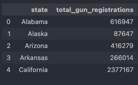 *Figure 6.1*    

### Census Metrics

Next we will get individual metrics from the US Census dataframe.

Since we'll be executing this block multiple times - one for each metric of interest - we need to create a function to handle the operations.

~~~python
# function to get individual census metrics by metric_id
def CENSUS_METRICS(metric_id, value):

    # filter census df
    mask = dfCensus['metric_id'] == metric_id
    df = dfCensus[mask]

    # reset index
    df.reset_index(inplace=True)

    # rename value column
    df = df.rename(columns={'value': value})

    # rearrange and trim dataframe
    df = df[['state', value]]

    return df
~~~

 

Now we can create dataframes with a narrow focus for census metrics that might have a relationship with gun registrations.

~~~python
# get individual census metrics

# Population Estimates (2016) - 'Population estimates, July 1, 2016,  (V2016)'
dfCensus1 = CENSUS_METRICS(1, 'population_estimate')

# Population by Race - 'Black or African American alone, percent, July 1, 2016,  (V2016)'
dfCensus14 = CENSUS_METRICS(14, 'percent_of_population_black_african_american')

# Population by Race - 'American Indian and Alaska Native alone, percent, July 1, 2016,  (V2016)'
dfCensus15 = CENSUS_METRICS(15, 'percent_of_population_american_indian')

# Population by Race - 'Asian alone, percent, July 1, 2016,  (V2016)'
dfCensus16 = CENSUS_METRICS(16, 'percent_of_population_asian')

# Population by Race - 'Native Hawaiian and Other Pacific Islander alone, percent, July 1, 2016,  (V2016)'
dfCensus17 = CENSUS_METRICS(17, 'percent_of_population_pacific_islander')

# Population by Race - 'Two or More Races, percent, July 1, 2016,  (V2016)'
dfCensus18 = CENSUS_METRICS(18, 'percent_of_population_two_or_more_races')

# Population by Race - 'Hispanic or Latino, percent, July 1, 2016,  (V2016)'
dfCensus19 = CENSUS_METRICS(19, 'percent_of_population_hispanic')

# Population by Race - 'White alone, not Hispanic or Latino, percent, July 1, 2016,  (V2016)'
dfCensus20 = CENSUS_METRICS(20, 'percent_of_population_white')

# Population by Education Level - 'Bachelor's degree or higher, percent of persons age 25 years+, 2011-2015'
dfCensus36 = CENSUS_METRICS(36, 'percent_of_population_bachelors_degree')

# Median Household Income - 'Median household income (in 2015 dollars), 2011-2015'
dfCensus48 = CENSUS_METRICS(48, 'median_household_income')

# Percent of Population in Poverty - 'Persons in poverty, percent'
dfCensus50 = CENSUS_METRICS(50, 'percent_of_population_in_poverty')

# Median Home Value - 'Median value of owner-occupied housing units, 2011-2015'
dfCensus26 = CENSUS_METRICS(26, 'median_home_value')
~~~

 

Finally, we need to merge the gun totals dataframe with the all the US Census dataframes.

When we started, the data was wide based on state. Then we melted it into long format. Now we're widening it again, but this time by metric.

~~~python
# merge metric dataframes

# create list of metric dataframes
metricDataFrames = [
    dfGunTotals,
    dfCensus1,
    dfCensus14,
    dfCensus15,
    dfCensus16,
    dfCensus17,
    dfCensus18,
    dfCensus19,
    dfCensus20,
    dfCensus36,
    dfCensus48,
    dfCensus50,
    dfCensus26
]

# create master metrics dataframe
dfMetrics = dfStates[['name']].drop_duplicates()
dfMetrics.reset_index(inplace=True, drop=True)
dfMetrics = dfMetrics.rename(columns={'name': 'state'})

# merge individual metric dataframes to master metric df
for df in metricDataFrames:
    dfMetrics = dfMetrics.merge(df, on='state')

# preview df (6.2)
dfMetrics.head()
~~~

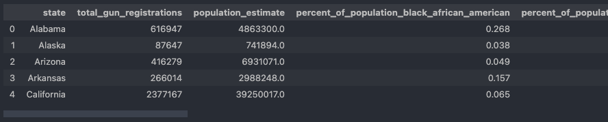 *Figure 6.2*    

 

#

## Exploratory Data Analysis

Before we start exploring our clean dataset, there are a few functions we can create to simplify our analysis.   

We're going to create three functions:
- Function to create a basic scatter plot
- Function to print correlation value (Pearsons)
- Function to create correlation matrix heatmap

~~~python
# function to create simple scatterplot
def SCATTERPLOT(df, metric1, metric2, title):
    plt.figure(figsize=(8, 8))
    sns.set(font_scale=1)

    scatter = sns.scatterplot(
        data=df, x=metric1, y=metric2
    )

    scatter.set(title=title)

# function to print pearsons correlation
def CORR_VALUE(df, metric1, metric2):
    corr, _ = pearsonr(df[metric1], df[metric2])
    print('Correlation: %.3f' % corr)

# function to create correlation matrix heatmaps
def CORR_MATRIX(df, title):
    plt.figure(figsize=(8, 8))
    sns.set(font_scale=1)

    corr = sns.heatmap(
        df.corr(), vmin=-1, vmax=1, center=0, square=True, annot=True,
        cmap=sns.diverging_palette(20, 220, n=200)
    )
    
    corr.set_xticklabels(
        corr.get_xticklabels(), rotation=45, horizontalalignment='right'
    )

    corr.set(title=title)
~~~

 

Now we can start answering exploring the data. While doing this, there are four questions I'd like to answer:

1. Which states have the most gun registrations per capita?
2. Are there any positive correlations between gun registrations and race?
3. What is the relationship between higher education and gun registrations?
4. What is the relationship between poverty and gun registrations?

 

While exploring and analyzing our datasets there are a few different plots and charts we'll utilize. I'll outline what those are and why they were selected here:

- Bar Chart *[\[3\]][3]*
  - A bar chart is pretty common, and we are going to employ one to show a comparison of metric values across subgroups of our data.
- Correlation Matrix Heatmap *[\[4\]][4]*
  - A correlation matrix is used to represent the statistical measure of linear relationships between different variables in a dataset, and a heatmap is simply the graphical representation of that matrix.
- Scatter Plot *[\[5\]][5]*
  - A scatter plot is used when you want to show whether or not a relationship exists between two variables. We use it below when comparing a single US census metric to the total gun registrations per capita.

 

### 1. Which states have the most gun registrations per capita?

~~~python
# calculate gun registrations per capita
dfMetrics['guns_per_capita'] = dfMetrics['total_gun_registrations'] / dfMetrics['population_estimate']

# create narrow df with state and guns_per_capita
dfRankByState = dfMetrics[['state','guns_per_capita']]
dfRankByState.head()

# sort df in descending order
dfRankByState = dfRankByState.sort_values(
    by=['guns_per_capita'],
    ascending=False
)

# reset index
dfRankByState.reset_index(inplace=True, drop=True)

# create ranking
dfRankByState.reset_index(level=0, inplace=True)
dfRankByState['ranking'] = dfRankByState['index'] + 1
del dfRankByState['index']

# reorder dataframe
dfRankByState = dfRankByState[['ranking', 'state', 'guns_per_capita']]

# print rankings (7.1)
dfRankByState
~~~

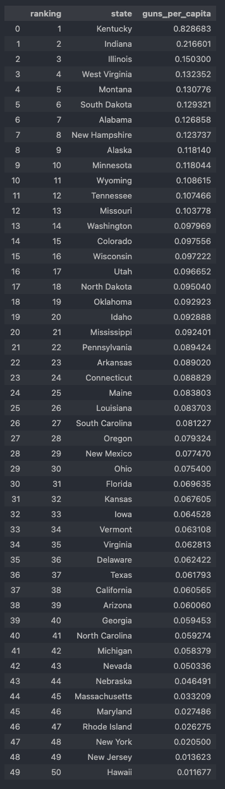 *Figure 7.1*    

~~~python
# create bar plot to visualize rankings

# adjust plot settings
plt.figure(figsize=(8, 10))
sns.set(font_scale=1)

# create bar plot
bar = sns.barplot(
    data=dfRankByState,
    x='guns_per_capita',
    y='state',
    color='royalblue'
)

# set plot title
bar.set(title='Total Gun Registrations by State (2016)')
~~~

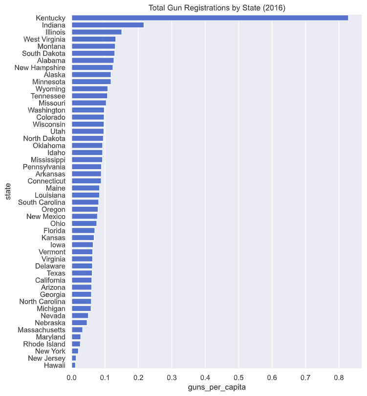 *Figure 7.2*    

 

#### *Observations:*
It looks like Kentucky has more gun registrations per capita than any other state, and it's not even close.

Because Kentucky is an extreme outlier, we are going to remove it from the dataset for the remainder of our exploration.

~~~python
# drop Kentucky
dfNoKentucky = dfMetrics.drop([16])
~~~

 

### 2. Are there any positive correlations between gun registrations and race?

~~~python
# create dataframe with metrics pertaining to race

# create list us census metrics relating to race
cols = [
    'guns_per_capita',
    'percent_of_population_black_african_american',
    'percent_of_population_american_indian',
    'percent_of_population_asian',
    'percent_of_population_pacific_islander',
    'percent_of_population_two_or_more_races',
    'percent_of_population_hispanic',
    'percent_of_population_white'
]

# filter dataframe to include only those metrics
dfRaceMetrics = dfNoKentucky[cols]

# preview df (8.1)
dfRaceMetrics.head()
~~~

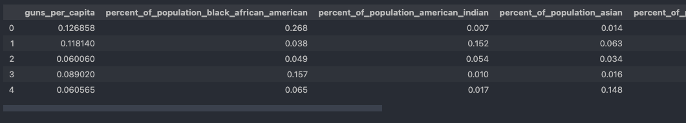 *Figure 8.1*    

~~~python
# look for any correlations with matrix heatmap (8.2)
CORR_MATRIX(dfRaceMetrics, 'Correlation Matrix - US Census Population by Race (2016)')
~~~

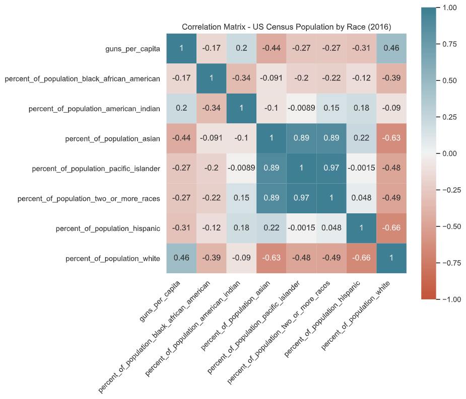 *Figure 8.2*    

#### *Observations:*
It looks like there is only one positive correlation. Although the relationship between guns_per_capita and the percent_of_population_white is weak, we should still take a closer look. *[\[6\]][6]*

~~~python
# guns_per_capita & percent_of_population_white

# print pearsons correlation value (8.3)
CORR_VALUE(dfRaceMetrics, 'guns_per_capita', 'percent_of_population_white')

# create scatterplot (8.4)
SCATTERPLOT(
    df=dfRaceMetrics, 
    metric1='guns_per_capita', 
    metric2='percent_of_population_white',
    title='Percent of Population White vs. Gun Registrations per Capita'
)
~~~

 *Figure 8.3*    
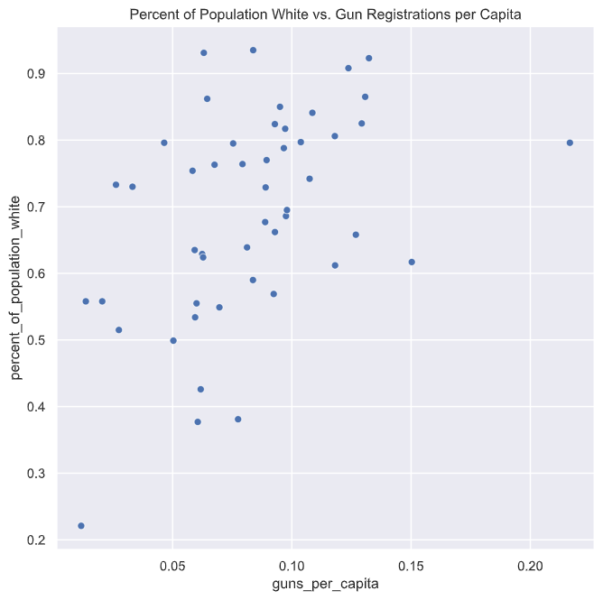 *Figure 8.4*    

#### *Observations:*
A weak positive correlation exists (0.46) between the percentage of the population that self-identifies as white and the number of gun registrations per capita.

 

### 3. What is the relationship between higher education and gun registrations?

~~~python
# create dataframe with guns per capita and percentage of population with bachelors degree

# create narrow df and preview (9.1)
dfEducationMetric = dfNoKentucky[['guns_per_capita', 'percent_of_population_bachelors_degree']]
dfEducationMetric.head()
~~~

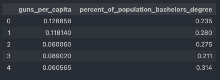 *Figure 9.1*    

~~~python
# guns_per_capita & percent_of_population_bachelors_degree

# print pearsons correlation value (9.2)
CORR_VALUE(dfEducationMetric, 'guns_per_capita', 'percent_of_population_bachelors_degree')

# create scatterplot (9.3)
SCATTERPLOT(
    df=dfEducationMetric, 
    metric1='guns_per_capita', 
    metric2='percent_of_population_bachelors_degree',
    title='Percent of Population with Bachelors Degree vs. Gun Registrations per Capita'
)
~~~

 *Figure 9.2*    
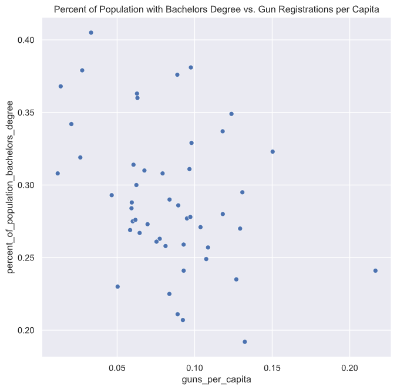 *Figure 9.3*    

#### *Observations:*
A weak negative correlation exists (-0.37) between the percentage of the population that hold a Bachelors Degree or above and the number of gun registrations per capita.

 

### 4. What is the relationship between poverty and gun registrations?

~~~python
# create dataframe with income, home value, and poverty metrics

# create list us census metrics relating to poverty
cols = [
    'guns_per_capita',
    'median_household_income',
    'percent_of_population_in_poverty',
    'median_home_value'
]

# create narrow df
dfPovertyMetrics = dfNoKentucky[cols]

# preview df (10.1)
dfPovertyMetrics.head()
~~~

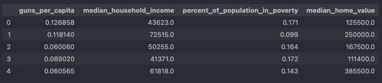 *Figure 10.1*    

~~~python
# look for any correlations with matrix heatmap (10.2)
CORR_MATRIX(dfPovertyMetrics, 'Correlation Matrix - Poverty, Income, and Home Value (2016)')
~~~

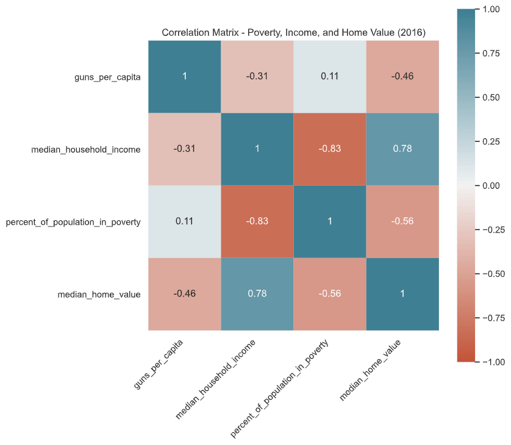 *Figure 10.2*    

It looks like there are two positive correlations. Although both relationships are classified as weak, [\[3\]][3] we should still take a closer look.

~~~python
# guns_per_capita & median_home_value

# print pearsons correlation value (10.3)
CORR_VALUE(dfPovertyMetrics, 'guns_per_capita', 'median_home_value')

# create scatterplot (10.4)
SCATTERPLOT(
    df=dfPovertyMetrics, 
    metric1='guns_per_capita', 
    metric2='median_home_value',
    title='Median Home Value vs. Gun Registrations per Capita'
)
~~~

 *Figure 10.3*    
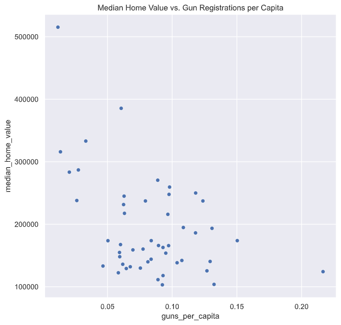 *Figure 10.4*    

#### *Observations:*
A weak negative correlation exists (-0.46) between the median home value and the number of gun registrations per capita.

~~~python
# guns_per_capita & median_household_income

# print pearsons correlation value (10.5)
CORR_VALUE(dfPovertyMetrics, 'guns_per_capita', 'median_household_income')

# create scatterplot (10.6)
SCATTERPLOT(
    df=dfPovertyMetrics, 
    metric1='guns_per_capita', 
    metric2='median_household_income',
    title='Median Household Income vs. Gun Registrations per Capita'
)
~~~

 *Figure 10.5*    
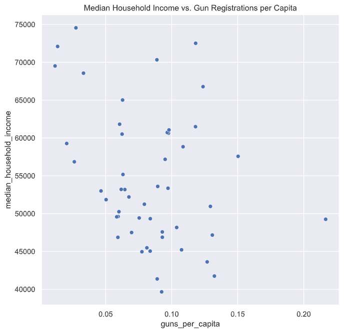 *Figure 10.6*    

#### *Observations:*
A weak negative correlation exists (-0.31) between the median household income and the number of gun registrations per capita.

 

#

## Conclusions

After a thorough cleaning of the US Census Data we were able to explore the relationships between a select few population metrics and the total gun registrations for 2016. We discovered a few weak correlations:
- A weak positive correlation exists (0.46) between the percentage of the population that self-identifies as white and the number of gun registrations per capita.
- A weak negative correlation exists (-0.37) between the percentage of the population that hold a Bachelors Degree or above and the number of gun registrations per capita.
- A weak negative correlation exists (-0.46) between the median home value and the number of gun registrations per capita.
- A weak negative correlation exists (-0.31) between the median household income and the number of gun registrations per capita.

We learned that Kentucky (0.8) has four times as many gun registrations per capita when compared to the next highest state - Indiana (0.2). It's unclear from our analysis whether that means there are more guns being purchases in Kentucky or if Kentucky state has a higher registration rate than other states. The top five states with the most gun registrations per capita (GRC) are:

| Rank  | State         | GRC   |
| ---:  | :---          | ---:  |
| 1     | Kentucky      | 0.83  |
| 2     | Indiana       | 0.22  |
| 3     | Illinois      | 0.15  |
| 4     | West Virginia | 0.13  |   
| 5     | Montana       | 0.13  |

 

### Limitations
One major limitation present in this project is the lack of year-over-year data. The census data available for this analysis primarily covered 2016. Also, in an effort to keep this project small, we only explored a select few US Census metrics and their relationships to the FBI NICS Firearm data. If this were a larger project, we would aim to review historical and current data along with what we have for 2016; and we'd explore the other available US Census metrics instead of just a handful.

 

#
## References

[1]: https://github.com/BuzzFeedNews/nics-firearm-background-checks/blob/master/README.md "FBI NICS Firearm Background Check Data"

[2]: http://www.gapminder.org/data/ "Gapminder World"

[3]: https://chartio.com/learn/charts/bar-chart-complete-guide/ "A Complete Guide to Bar Charts"

[4]: https://vitalflux.com/correlation-heatmap-with-seaborn-pandas/ "What is a Correlation Heatmap?"

[5]: https://visme.co/blog/scatter-plot/ "What is a Scatter Plot?"

[6]: https://www.statology.org/what-is-a-strong-correlation/ "What is Considered to Be a 'Strong' Correlation?"

[\[1\] FBI NICS Firearm Background Check Data][1]

[\[2\] Gapminder World][2]

[\[3\] A Complete Guide to Bar Charts][3]

[\[4\] What is a Correlation Heatmap?][4]

[\[5\] What is a Scatter Plot?][5]

[\[6\] What is Considered to Be a 'Strong' Correlation?][6]