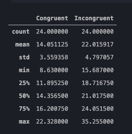
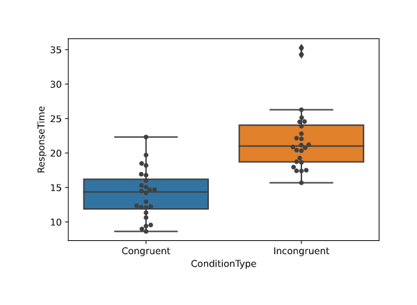
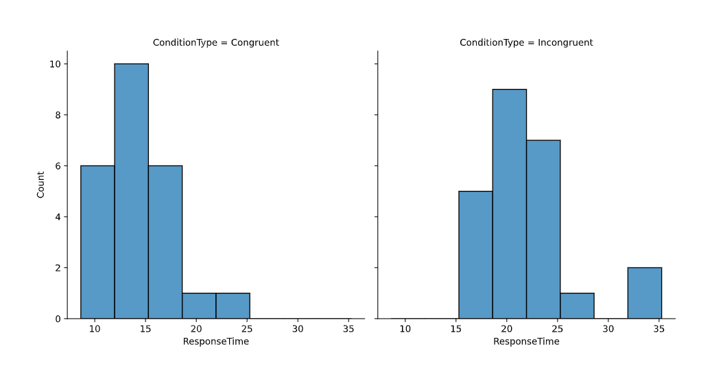
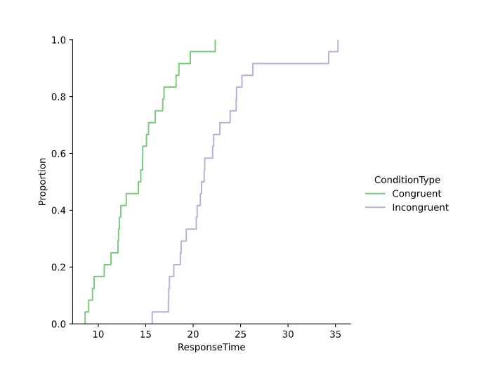
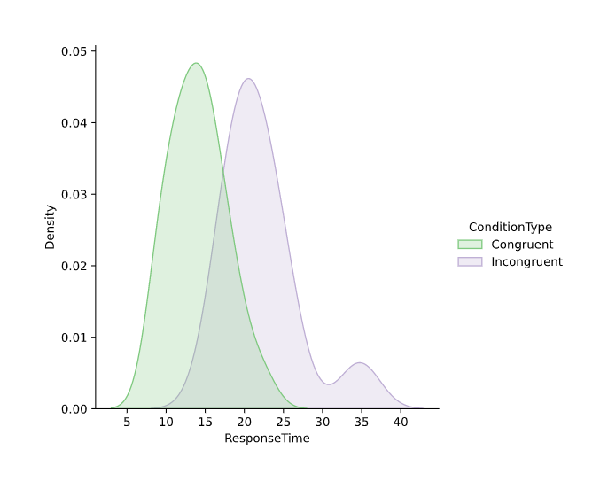

# Statistical Analysis – The Stroop Effect

In a Stroop test, participants are presented with a list of words, with each word displayed in a color of ink. The participant’s task is to say out loud the color of the ink in which the word is printed. The task has two conditions: a congruent words condition, and an incongruent words condition.

In the congruent words condition, the words being displayed are color words whose names match the colors in which they are printed. In the incongruent words condition, the words displayed are color words whose names do not match the colors in which they are printed. In each case, we measure the time it takes to name the ink colors in equally sized lists.

Experimental findings have shown that when participants are asked to name the color of the word their response has a higher rate of error, and takes longer, when the name of the color does not match the color of the ink. This effect is known as the Stroop effect – the delay in reaction time between congruent and incongruent stimuli. [\[1\]][1]

- You can try the Stroop test out for yourself here: [Interactive Stroop Test][2]
- The rest of this page explores Stroop test data that can be found here: [Stroop Test Dataset][3]

 

### Independent Variable
The variable in an experiment that is changed: for a Stroop effect experiment, the independent variable is – whether the words are congruent with the color in which they were printed, or incongruent with those colors.   [\[4\]][4]

 

### Dependent Variable
The variable in an experiment that is measured: for a Stroop effect experiment, the dependent variable is – the time it takes each participant to identify the colors for all the words provided. [\[4\]][4]

 

### Alternative Hypothesis
The outcome a researcher is anticipating: for a Stroop effect experiment, the alternative hypothesis is – for the sample population, the average response time under the congruent words condition is less than the average response time under the incongruent words condition.

 

### Null Hypothesis
The opposite of the alternative hypothesis: for a Stroop effect experiment, the null hypothesis is – the difference between the mean response times for the sample populations is not statistically significant when comparing those under the incongruent words condition and those under the congruent words condition.

 

### Statistical Test
For this dataset, we do not know the population standard deviation, and the sample size is less than 30; this means we cannot use a z-test. [\[5\]][5]

A good test to use for this project is a paired sample t-test. However, several assumptions must be met in order for paired sample t-test results to be trusted. [\[6\]][6]
- The observations are independent
- The data needs to be continuous when measured on a ratio or interval scale
- The data should be roughly normally distributed. 
  - The paired sample t-test is quite robust to violations of this assumption, and the test results can be considered valid so long as there isn’t a major violation of normality.

 

## Descriptive Statistics

The first step before we can analyze the dataset is to import the sample dataset into Python. We’ll read the data using the pandas library. After that, we can print the data frame to get an idea of how the data is structured.

~~~python
# import data and take a look
import pandas as pd

df = pd.read_csv('stroopData.csv')
print(df)
~~~

 

Next, we’ll print some high-level descriptive statistics.

~~~python
# get summary statistics
df[['Congruent', 'Incongruent']].describe()
~~~

 

## Visualizing Distributions

Often, the best way to discover patterns is to visually compare distributions. However, we first need to reshape the data into a format more conducive to creating visualizations in Python.

~~~python
# clean data frame prior to analysis

# convert index into participant id
df.reset_index(level=0, inplace=True)
df['ParticipantID'] = df['index'] + 1
del df['index']

# reshape data frame into long format
stroop_df = pd.melt(df, \
    id_vars = 'ParticipantID', \
    value_vars = ['Congruent', 'Incongruent'], \
    var_name = 'ConditionType', \
    value_name = 'ResponseTime')

print(stroop_df)
~~~

 

Now that our data is ready to go, we can import the Python library used to create all the visualizations in this article: seaborn.

~~~python
# import visualization library
import seaborn as sns
~~~

 

### Box Plot & Swarm Plot
First, we’re going to create a box plot and swarm plot; then stack them on top of one another. This visualization allows us to easily spot any outliers.

~~~python
# box plot with swarm to check for outliers

sns.boxplot(data = stroop_df, \
    x = 'ConditionType', \
    y = 'ResponseTime')

sns.swarmplot(data = stroop_df, \
    x = 'ConditionType', \
    y = 'ResponseTime', \
    color = '.25')
~~~

 

If we take a look at this plot, we can see that the congruent response times do not have any outliers, but the incongruent response times have a few.

### Histograms
Next, we create a histogram for both the congruent and incongruent response times. Histograms are helpful when analyzing the underlying frequency distribution of a set of continuous data. [\[7\]][7]

~~~python
# histogram

sns.displot(stroop_df, \
    x = 'ResponseTime', \
    col = 'ConditionType', \
    multiple = 'dodge')
~~~

 

The histograms reveal that the response time is greater for those data points recorded under incongruent conditions when compared to those recorded under congruent conditions.

### Empirical Cumulative Distributions
Another option for visualizing distributions is performed by charting the empirical cumulative distribution function (ECDF). This plot represents a monotonically increasing line through each datapoint such that the height of the line represents the proportion of observations with a smaller value. This plot has a distinct advantage over a histogram – it directly represents each datapoint. This means there is no bin size to consider. [\[8\]][8]

~~~python
# empirical cumulative distributions

sns.displot(stroop_df, \
    x = 'ResponseTime', \
    hue = 'ConditionType', \
    kind = 'ecdf', \
    palette = 'Accent')
~~~

 

The ECDF plot suggests that the incongruent condition adversely affects the participant response times.

### Kernel Density Estimations
Our previous attempts at visualizing this data have done a good job comparing the distributions of our different response times, but only if we understand how to read and interpret box plots, swarm plots, histograms, and ECDF plots. 

In order to create a visualization that is quickly and easily understood by the average reader, we turn to the kernel density estimation (KDE) plot. Using KDE plots has several advantages: 
- They allow for simple comparisons between subsets
- Important features of the data are easy to discern (bimodality, central tendency, skew, etc.) [\[8\]][8]

~~~python
# kernel density estimation

sns.displot(stroop_df, \
    x = 'ResponseTime', \
    hue = 'ConditionType', \
    kind = 'kde', \
    fill = True, \
    palette = 'Accent')
~~~

 

When comparing the two subsets of data for the congruent and incongruent conditions visualized on our KDE plot, it’s clear that dataset for the incongruent condition is shifted to the right; further reinforcing our idea that participant response times under the incongruent condition (*purple*) are slower than those under the congruent condition (*green*).

  

## Statistical Analysis 

In the previous section we observed some interesting trends, but now we need to perform some statistical analysis to determine whether we can reject our null hypothesis. Specifically, we want to establish that the difference between mean response times of participants under congruent conditions and incongruent conditions is greater than zero. We do this by rejecting our null hypothesis – the difference between mean response times for the sample populations is not a result of the change between congruent conditions and incongruent conditions. 

For the reasons outlined above, we have decided to utilize the paired sample t-test for this analysis.  We will select a confidence interval of 99%, meaning we reject the null hypothesis if the p-value is less than 0.01. To perform this test, and to calculate our t-distribution and p-value, we will utilize the stats Python package.

~~~python
# paired sample t-test
from scipy import stats

t_val, p_val = stats.ttest_rel(df.Incongruent, df.Congruent)
print("t-distribution = %g" % t_val)
print("p-value = %g" % p_val)
~~~

> t-distribution = 8.02071  
> p-value = 4.103e-08

 

This function returns a two-tailed p-value, but our alternative hypothesis is one-tailed; this means we need to adjust the p-value by dividing it by two before comparing it to our selected confidence interval. [9]

~~~python
# adjusted p-value

adj_p_val = p_val / 2
print("adjusted p-value = %g" % adj_p_val)
~~~

> adjusted p-value = 2.0515e-08

 

Our adjusted p-value is 2.0515e-08 which is less than the alpha value of 0.01 we determined above. Therefore, the null hypothesis can be rejected, and our alternative hypothesis can be accepted.

 

## Discussion 

The Stroop test dataset provided evidence that the participants could correctly identify the color of the ink in which the word is printed faster when the colors matched the word (congruent conditions). Through statistical inference we have demonstrated with 99% confidence that this evidence shows a significant effect that can be generalize to the larger population.

Although our statistical analysis confirms the existence of a real effect – as opposed to random chance – it does not provide any explanation for *why* this occurs.

The objective of the Stroop test is to identify the color in which the words are printed. The results suggest that participants read the word before determining the color despite knowing that the word and its meaning are irrelevant to the exercise.

There are two cognitive processes at play: 
  1. Reading and interpreting the text of the word
  2. Identifying the color in which the word is printed.

The Stroop test and these data indicate that the reading process inhibits the color-identifying process and causes a delay in the time it takes to determine the color of ink used.

It would be interesting to explore a few variations to this experiment in the future. What happens when the colors are written in a language the reader is not familiar with? What about if the words are gibberish or upside-down?

 

## References

[1]: https://en.wikipedia.org/wiki/Stroop_effect "Wikipedia - Stroop Effect"
[2]: https://faculty.washington.edu/chudler/java/ready.html "Interactive Stroop Test"
[3]: https://drive.google.com/file/d/0B9Yf01UaIbUgQXpYb2NhZ29yX1U/ "Stroop Test Dataset"
[4]: https://www.verywellmind.com/what-is-the-stroop-effect-2795832 "The Stroop Effect: Naming a Color but Not the Word"
[5]: https://www.analyticsvidhya.com/blog/2020/06/statistics-analytics-hypothesis-testing-z-test-t-test/ "Statistics for Analytics and Data Science: Hypothesis Testing and Z-Test vs. T-Test"
[6]: https://pythonfordatascienceorg.wordpress.com/paired-samples-t-test-python/ "Python for Data Science - Paired Sample t-test"
[7]: https://statistics.laerd.com/statistical-guides/understanding-histograms.php "Laerd Statistics - Understanding Histograms"
[8]: https://seaborn.pydata.org/tutorial/distributions.html "Seaborn - Visualizing distributions of data"
[9]: https://stats.idre.ucla.edu/other/mult-pkg/faq/general/faq-what-are-the-differences-between-one-tailed-and-two-tailed-tests/ "UCLA - What are the differences between one-tailed and two-tailed tests?"

[\[1\] Wikipedia - Stroop Effect][1]

[\[2\] Interactive Stroop Test][2]

[\[3\] Stroop Test Dataset][3]

[\[4\] The Stroop Effect: Naming a Color but Not the Word][4]

[\[5\] Statistics for Analytics and Data Science: Hypothesis Testing and Z-Test vs. T-Test][5]

[\[6\] Python for Data Science - Paired Sample t-test][6]

[\[7\] Laerd Statistics - Understanding Histograms][7]

[\[8\] Seaborn - Visualizing distributions of data][8]

[\[9\] UCLA - What are the differences between one-tailed and two-tailed tests?][9]